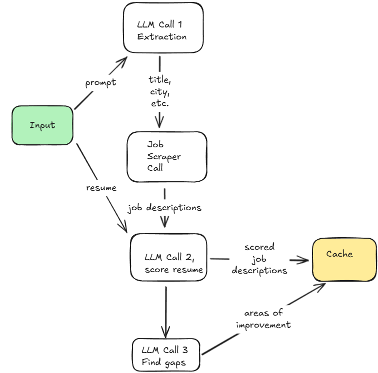

# jobsearch-ai# jobsearch-ai

`jobsearch-ai` is a command-line tool that uses large language models (LLMs) to automate and enhance the job search process. It fetches job postings from LinkedIn, scores them against your resume using AI, and helps you identify the best matches.


## Application Workflow



## Features

- Fetches job postings from LinkedIn based on job title and city.
- Uses LLMs to evaluate and score how well your resume matches each job posting.
- Provides explanations for each score to help you understand your fit.
- Summarizes missing skills or experiences to help you improve your resume.
- Supports filtering for hybrid/remote jobs.
- Outputs the top job matches for your review.
- Saves all results and improvement suggestions to a cache file.

## Requirements

- Only tested on Python 3.13.5
- OpenAI API key
- Apify API key


## Installation

1. Clone the repository:
    ```sh
    git clone https://github.com/yourusername/jobsearch-ai.git
    cd jobsearch-ai
    ```

2. Install dependencies:
    ```sh
    pip install -r requirements.txt
    ```

3. Set your OpenAI API key in a `.env` file:
    ```
    OPENAI_API_KEY=your_openai_api_key_here
    APIFY_API_KEY=your_apify_api_key_here
    ```

## Usage

Prepare your resume as a plain text file (e.g., `resume.txt`).

Run the tool from the command line:

```sh
python main.py -r resume.txt -j "Data Scientist (AI)" -c "Austin" -l 10 --hybrid
```

### Arguments

- `-r, --resume_path` (required): Path to your resume in `.txt` format.
- `-j, --job_title` (required): The job title to search for.
- `-c, --city`: City to search for jobs (default: Austin).
- `-l, --limit`: Maximum number of job postings to fetch (default: 10).
- `--hybrid`: Include hybrid/remote jobs in the search.

## Project Structure

```
jobsearch-ai/
├── main.py                # Entry point for the CLI tool
├── job_boards/
│   └── linkedin.py        # LinkedIn job fetching logic
├── scoring/
│   ├── job_posts.py       # Job scoring logic
│   └── oa_models.py       # LLM interaction and scoring models
├── datamodels/
│   └── models.py          # Data models for job postings
├── data/
│   └── cache/             # Cached results (JSON files)
├── requirements.txt
└── README.md
```